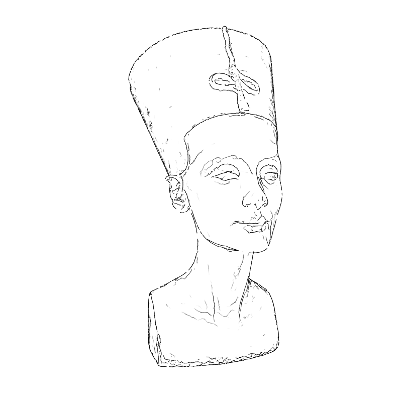
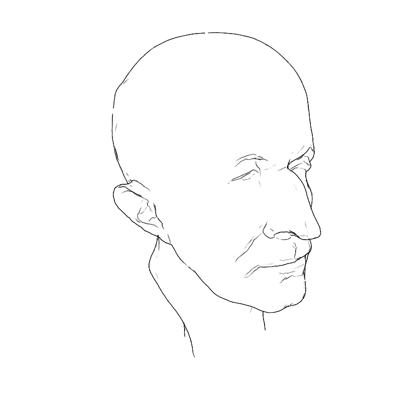
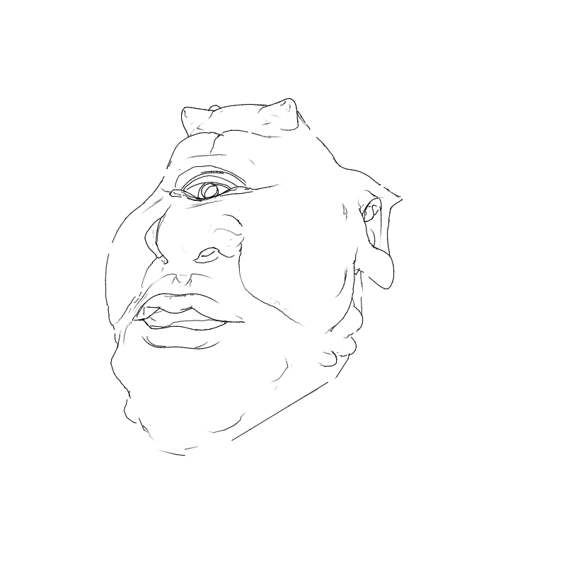
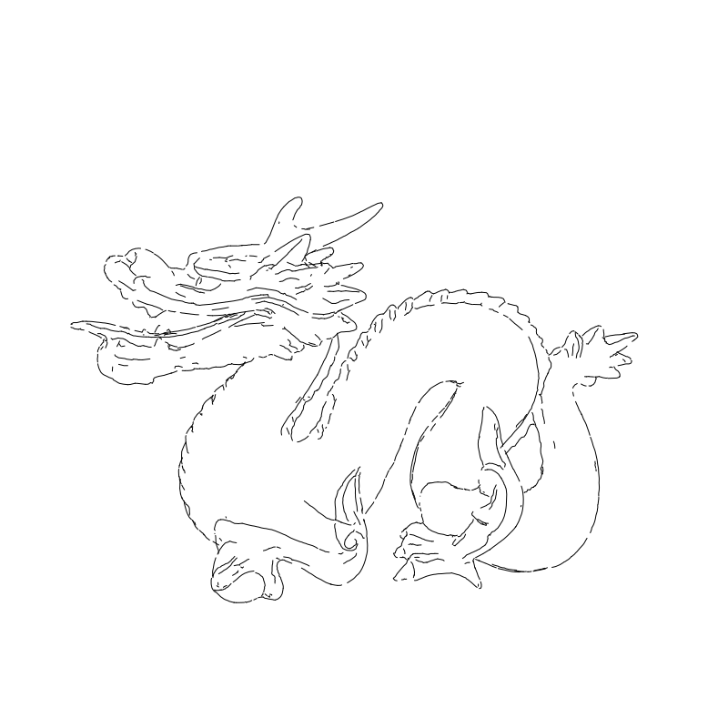
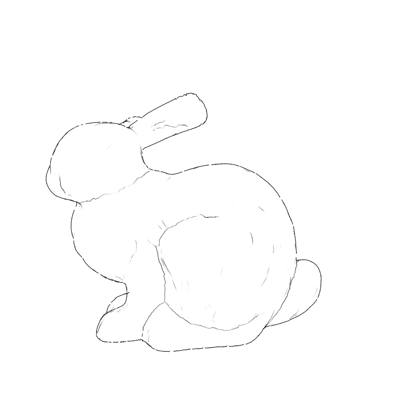

# ApparentRidges

*Render line drawings from 3D meshes, suitable for plotters*




ApparentRidges contains an implementation of the paper [Apparent Ridges for Line Drawing by Judd et al. 2007](http://people.csail.mit.edu/tjudd/apparentridges.html). It also includes a software raycaster to cull occluded lines, a custom algorithm to connect ridge segments into continous polylines suitable for plotters, as well as utilities for manipulating meshes and generating depth/normal/curvature maps.

Written in Haxe and transcompiled for your favourite programming language. Many parts of it are based on the awesome [RTSC](https://rtsc.cs.princeton.edu) viewer, which contains a C++ version of the Apparent Ridges algorithm.

#### Check out the [API documentation](), or an [Online Demo](https://creativeinquiry.github.io/ApparentRidges).


## Overview

The library is written in the [Haxe](https://haxe.org/) programming language, and is transpiled to **C/C++**, **JavaScript**, **Java**, **Python** and **Lua** ports, all of which is available in this repo, along with code examples in these languages. [Processing](https://processing.org/) and [OpenFrameworks](https://openframeworks.cc/) examples are also included. See **Navigation** section for details.

The library can be further transpiled to C#, PHP, SWF(Flash), JVM bytecode or Neko (a Haxe VM) but these will not be maintained in this repo.

A commandline interface (CLI) is also included for convenience. Two functionally equivalent (but performance-wise drastically different) versions exist: One is compiled from C++, one is a Python script.

A list of samples generated by this algorithm for the standard test meshes (bunny, dragon, etc.) can be found in the [samples/](./samples) folder. They're downloaded from the [Stanford collection](http://graphics.stanford.edu/data/3Dscanrep/) and [Keenan Crane's collection](https://www.cs.cmu.edu/~kmcrane/Projects/ModelRepository/), and modified with [Meshlab](https://www.meshlab.net/) to a reasonable amount of triangles (50k-500k) in OBJ format. The modified version of the models used by this repo can be downloaded [here](https://glitch.com/edit/#!/standard-meshes). **Some of the examples assume these files are in the `testdata/` folder in the repo**.

## Highlights

- Eats OBJ and spits SVG by default -- but custom loaders and writers can be plugged in due to modular design. The polylines can also be directly grabbed for drawing onto the screen for graphic applications.
- Different modes of output: Disconnected ridge segments (directly from the standard algorithm), connected polylines (via post-processing, suitable for plotters), or gradated rendering showing ridge strength along the strokes.
- Also capable of generating raster images including depth map, normal shading, curvature map, lambertian shading, ambient occusion. Includes a PPM format writer for easy preview.

See **Programming API** and **Commandline API** sections for details.

## Navigation

More Detail about the items might be found in each folder README or as code comments.

### Source

- Haxe source code in [`apparentridges/ApparentRidges.hx`](./apparentridges/ApparentRidges.hx)
- [CLI source code](./Cli.hx)


### Distribution

- [JavaScript version of the library](./js/apparentridges.js)
- [JavaScript interactive demo](https://creativeinquiry.github.io/ApparentRidges)
- [Render the sample meshes with JavaScript](./js/generatesamples.js)
- [Java version of the library](./java/ApparentRidges)
- [A .jar file for grabbing](./java/ApparentRidges.jar)
- [Processing library](./processing/ApparentRidges)
- [Processing example](./processing/ApparentRidgesExample)
- [Python version of the library](./py/apparentridges.py)
- [Python commandline interface](./py/cli.py)
- [Python example](./py/example.py)
- [Lua version of the library](./lua/apparentridges.lua)
- [Lua example](./lua/example.lua)
- [C++ version of the library](./cpp/ApparentRidges)
- [C++ commandline interface](./cpp/cli)
- [C version of the library](./hl/c)
- [C example](./hl/example.c)
- [OpenFrameworks example](./cpp/openframeworks/ApparentRidgesExample)

### Samples

- [`samples/`](./samples) folder containing reference renderings from this library.


## Compiling

Compiling is not neccessary to use the library, except for C/C++. This section is for people who'd like to modify / contribute to the source code.

The included [`Makefile`](./Makefile) automates compilation and testing. To compile for a library in particular target language (e.g. JavaScript), use 

```
make js
```
To compile libraries in all languages, use

```
make libs
```

To compile the commandline interface, use

```
make clis
```

To compile the commandline interface in a particular language (e.g. Python), use

```
make cli-py
```

To run tests the sample meshes, use

```
make tests
```

To test a particular mesh (e.g. the bunny), use

```
make test-bunny
```

To do all of the above all at once (takes quite a while!), use

```
make all
```


## Commandline Interface

```
usage:   apparentridges [options] [.obj files...]

option        default       description

--thresh      0.1           apparent ridge threshold
                            smaller => more detailed, larger => cleaner

--transform   auto()        place the model before rendering
                            (multiple commands are left-multiplied in order)
                            available commands:
                            focal(100) translate(1,2,3) scale(4,4,4)
                            rotateX(1) rotateY(2) rotateZ(3);
                            matrix(11,12,13,14,21,22,...,43,44)
                            rotation angles are in degrees
                            use auto() or auto(zFactor,fFactor) for automatic
                            placement. (cam is fixed at (0,0,0) pointing at +Z,
                            focal() needs to be specified for manual placement)

--output, -o  out-hher.svg  output filename
                            (randomly generated if not specified)

--verbose     1             verbosity: 0 => errors only, 1 => logs

--cull        true          don't draw occluded faces
                            options: true/false/custom float value (e.g. 1.5)
                            the float being a multiplier to the 'epsilon',
                            allowing ridges just barely occluded to show up

--width, -w   800           width of output image

--height, -h  800           height of output image

--mode        gradients     visualization technique, options:
                            vertices, edges, 
                            lines (disconnected ridge segments),
                            polylines (connected ridges via post-proc),
                            gradients (nice render showing ridge strength),
                            pixels (raster out: depth, norm., curv. maps)


```

## Programming API

Please also checkout the full [API Documentation](). This section covers a typical usage example.


Shown below is the JavaScript (node.js) API. API for ther languages work similarly, see respective examples listed in **Naviagtion** section above for details.


```js

// import the apparent ridges library
const {apparentridges} = require("./apparentridges");

// alias for lazy people
const AR = apparentridges;

// for loading files from disk
const fs = require('fs');

// load the .OBJ file: The head of Max Planck
let objstr = fs.readFileSync("./testdata/planck_100K.obj").toString();
let mesh = AR.OBJParser.fromString(objstr);

// alternatively, you can construct the mesh yourself, e.g.
// let mesh = new AR.Mesh();
// mesh.vertices.push([0.1,0.2,0.3]);
// mesh.faces.push([0,1,2]);

// create a renderer
// the renderer uses a simple pinhole camera model
// you can replace it with your own exquisite renderers if desired
let render = new AR.Render(mesh,800,800);

// rotate the model, so the Planck is not looking at the ground
render.transform(AR.Util.matRotx(-Math.PI*0.5));
render.transform(AR.Util.matRoty(Math.PI*0.2));
render.transform(AR.Util.matRotx(-0.3));

// autopmatically puts the model at a nice position for viewing
// the two parameters are multipliers to the z-distance and focal length.
// leave out to let the algorithm do the thinking.
render.autoPlace(3,2.4);

// render the apparent ridges.
// First argument is threshold (smaller->more detailed, larger->cleaner)
// Second argument controls the culling. For any negative values, there'll
// be no occlusion at all, allowing hidden lines to be seen. For non-negative
// values, this is used as the tolerance epsilon: larger values allows
// lines that're just blocked by a tiny bit to be seen.
render.apparentRidges(0.25,10);

// connect the ridge segments to continous polylines (optional)
render.buildPolylines();

// Use the SVG writer to write out the image.
// other modes: SVGWriter.lines, SVGWriter.gradients
let rstr = AR.SVGWriter.polylines(render);
fs.writeFileSync("output/planck.svg",rstr);

// we can also generate a curvature map (among many other maps) for the model
let pix = AR.PixelMap.curvature(render,true);
// Use a builtin PPM format writer for preview
// last two parameters are normalization range
let pstr = AR.PixelMap.toPPMString(pix,render.width,render.height,-0.5,0.5);
fs.writeFileSync("output/planck-curv.ppm",pstr);


```

## Gallery






